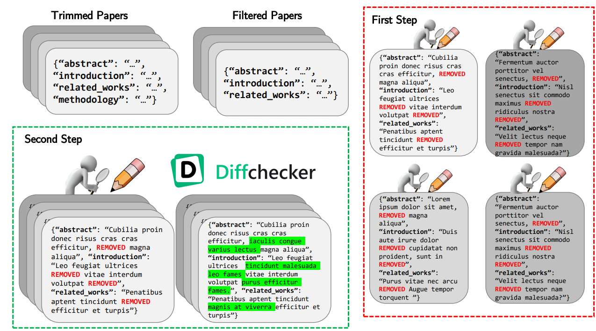
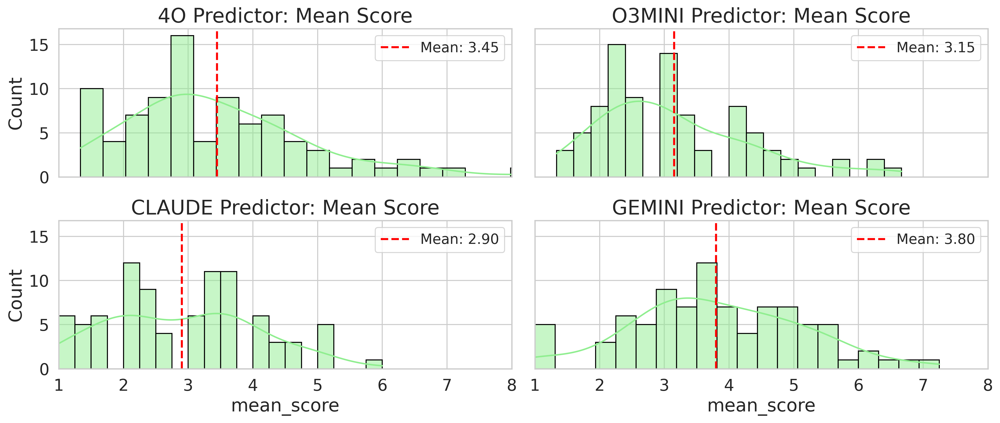

## FrontierScience-Bench: Evaluating-AI-Research-Capabilities-in-LLMs

This repository accompanies the research paper “FrontierScience Bench: Evaluating AI Research Capabilities in LLMs,” accepted to the First Workshop for Research on Agent Language Models (REALM) at ACL 2025. The codebase provides all resources, data, and evaluation tools described in our paper, which explores the scientific reasoning capabilities of large language models. For more information about the REALM workshop, visit https://realm-workshop.github.io/.

The full paper can be found at <Arxiv Here>

## Table of Contents
- [Abstract](#abstract)
- [Overview](#overview)
- [Redaction Pipeline](#redaction-pipeline)
- [Results](#results)
- [Ethics](#ethics)
- [Setup Instructions](#setup-instructions)
- [BibTex](#bibtex)
  - [Verdict](#verdict)

## Abstract

Large language models (LLMs) have shown remarkable capabilities across various tasks, yet their potential to reason about and construct scientific methodologies remains under explored. This work introduces a novel benchmark evaluating LLMs’ capacity to predict methodological details in AI research papers. We construct a dataset of 88 papers with redacted methodology sections and zero-shot prompt several state-of-the-art LLMs to generate methodology predictions.

Our evaluation framework then employs a LLM-as-judge system with multiple LLM judges, majority voting, and self-omission techniques to minimize biases. We validate our LLM judge scores against human judgments. We then briefly analyze the judging results of our zero-shot prediction pipeline, suggesting that even state-of-the-art LLMs struggle with the task of methodology generation without more advanced techniques. This benchmark lays the groundwork for future research into evaluating LLMs’ potential for aiding in AI research. 

## Overview
The benchmark consists of three stages:

- Dataset curation: We created a dataset of 88 research papers, redacted to remove their methodology sections, results, and any references to methodology found in other sections.
- Prediction: Using this new dataset, we zero-shot prompted multiple state-of-the-art LLMs—including GPT-4o, o3-mini, Claude 3.5 Sonnet, and Gemini 1.5 Pro—to generate methodologies.
- Evaluation: We used an LLM-as-a-Judge framework to evaluate how close the predicted methodologies were to the original ones.

Our paper curation process is detailed in the figure below.



## Redaction Pipeline

After selecting and processing papers, we passed them through our two-stage redaction pipeline to remove the author’s methodologies.

- Stage 1: We first took the trimmed paper in JSON format and removed the methodologies field (denoted as the filtered paper).

- Stage 2: To address minor instances of methodologies spread throughout other sections, we applied two layers of manual removal:

Each author removed revealing information from their assigned range of papers.
A single author then reviewed all annotations, alongside the trimmed paper, and made further changes where necessary.
This process ensured high-fidelity redaction and reduced variability from having many human annotators.

To aid manual redaction, we used DiffChecker to visualize differences between original and redacted papers.


## Results

The figure below shows the aggregated score distributions for each predictor LLM, illustrating overall performance trends. All models average between 3 and 3.5. Due to the knowledge cutoff, we refrain from directly comparing the predictor LLMs. Nonetheless, the right-skewed distributions and low averages suggest that state-of-the-art LLMs struggle to consistently produce high-quality methodologies when prompted zero-shot. Although they capture some fundamental steps, they lack the fine-grained, domain-specific details needed for rigor. These findings highlight the need for further innovation to guide LLMs toward generating robust scientific methodologies



It is important to note that because the dataset exclusively contains AI/ML papers with 15 pages or less, it narrows the scope of our evaluation, making it unclear whether our findings would generalize to other disciplines, such as medicine or social sciences, where experimental frameworks may differ significantly.

We imposed this page limit due to context window limits and to constrain the manual redaction process. This may exclude more rigorous methodologies in longer research papers that are more challenging to predict. Additionally, papers with extensive mathematical notation were excluded due to PyMuPDF parsing failures. This limits our benchmark’s applicability to theoretical or math-heavy research and may inflate model performance. Finally, while all 88 papers were published after GPT4o’s October 2023 cutoff to minimize training data overlap, we later included models with later cutoffs (e.g., Claude 3.5 Sonnet, Gemini 1.5 Pro). This introduces a risk of training data contamination in those models.

## Ethics

This benchmark is designed as a diagnostic tool to assess the reasoning capabilities of LLMs and does not aim to automate scientific authorship or replace human researchers. This task isolates the problem of reconstructing plausible methodological reasoning from surrounding content for evaluation purposes. We acknowledge the risks of misuse, such as treating generated methods as ready for use in real AI research. To reduce this risk, we frame our task as a diagnostic benchmark, not a writing tool, and do not recommend using these systems in scientific work without safeguards.

## Setup Instructions

## BibTex

If you use this benchmark or codebase, please cite:

```bibtex
  @inproceedings{horwitz2024recovering,
          title={FrontierScience Bench: Evaluating AI Research Capabilities in LLMs},
          author={Matthew Li*, Santiago Torres-Garcia*, Shayan Halder, 
                Phani Kuppa, Vasu Sharma, Sean O'Brien, Kevin Zhu, Sunischal Dev},
          booktitle={ACL REALM},
          year={2025},
          organization={Algoverse AI Research}
        }
```
### Verdict

```bibtex
@article{kalra2025verdict,
  title={Verdict: A Library for Scaling Judge-Time Compute},
  author={Nimit Kalra and Leonard Tang},
  journal={arXiv preprint arXiv:2502.18018},
  year={2025}
}
```